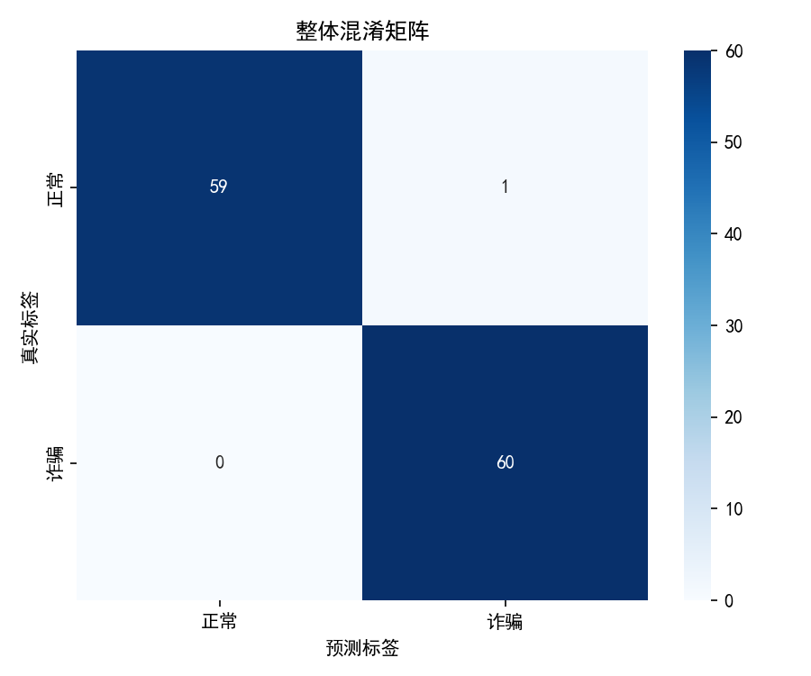
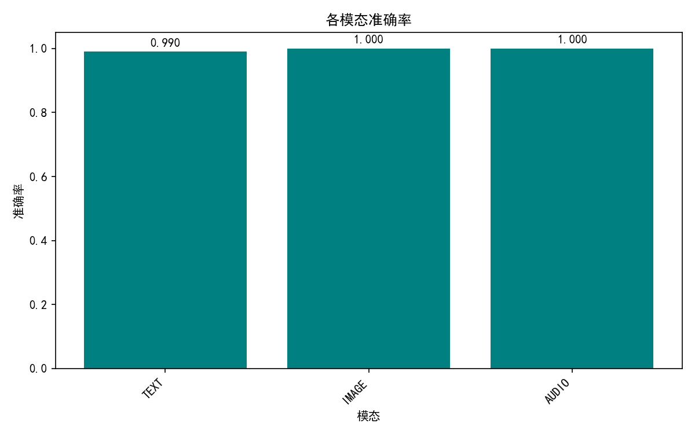
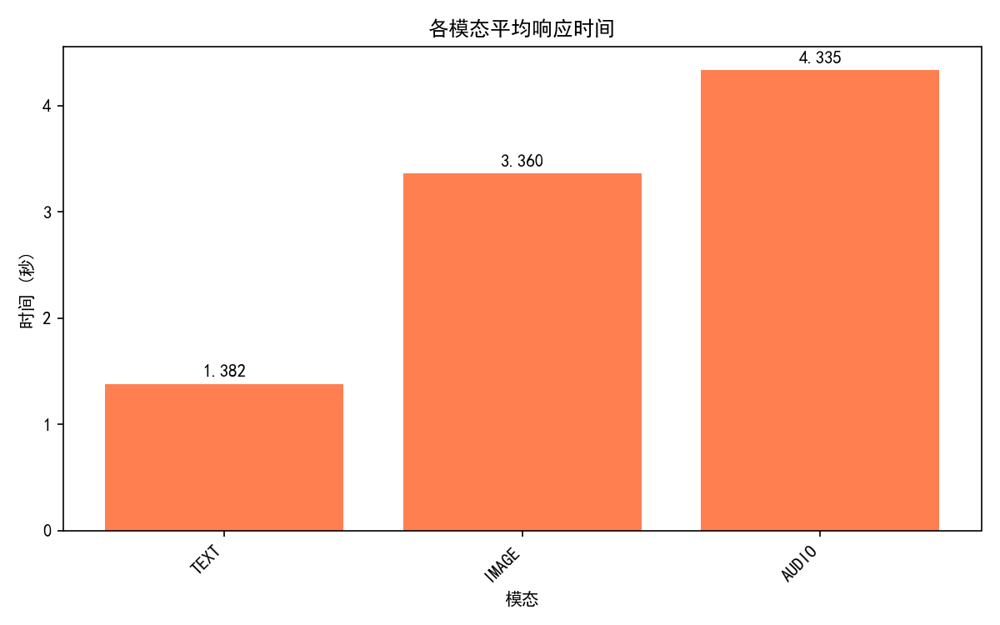
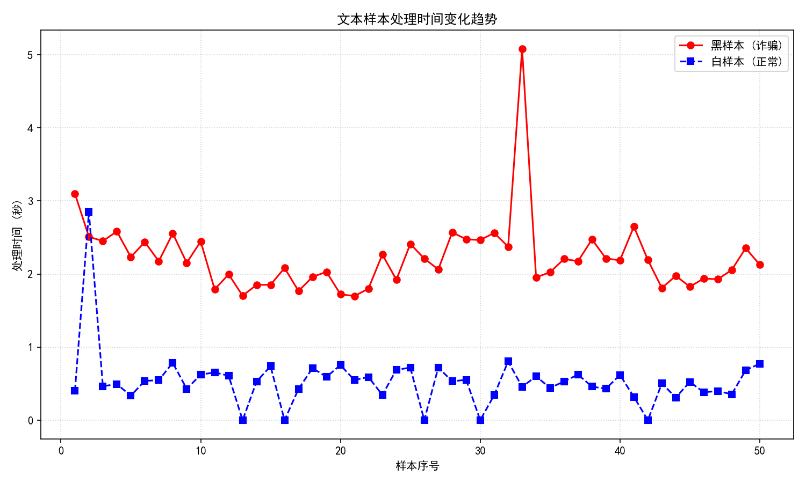

# 多模态反诈智能助手评估报告

**生成时间**: 2026-04-22 08:49:25

## 一、整体评估指标

| 指标 | 数值 |
|------|------|
| 总案例数 | 120 |
| 准确率 (Accuracy) | 0.9917 |
| 精确率 (Precision) | 0.9836 |
| 召回率 (Recall) | 1.0000 |
| F1分数 (F1-score) | 0.9917 |
| 平均响应时间 | 1.79 秒 |

### 混淆矩阵

## 二、按模态分类统计

| 模态 | 案例数 | 准确率 | 精确率 | 召回率 | F1分数 | 平均耗时(秒) |
|------|--------|--------|--------|--------|--------|--------------|
| TEXT | 100 | 0.9900 | 0.9804 | 1.0000 | 0.9901 | 1.38 |
| IMAGE | 10 | 1.0000 | 1.0000 | 1.0000 | 1.0000 | 3.36 |
| AUDIO | 10 | 1.0000 | 1.0000 | 1.0000 | 1.0000 | 4.34 |

### 各模态准确率对比

### 各模态平均响应时间对比

### 文本处理时间变化趋势

下图展示了黑样本（诈骗）和白样本（正常）的每个文本处理时间变化情况。

## 三、详细结果

详细结果已保存至 `evaluation_report.json`。

## 四、压力测试

- **测试方法**：连续运行测试集 5 轮，每轮包含 100 个文本案例（黑白各半），记录准确率和耗时。
- **结果**：
  - 运行轮数：5
  - 平均准确率：0.9900
  - 平均每轮耗时：128.11 秒
  - **系统稳定性**：5 轮测试中无崩溃、无异常，运行正常。
